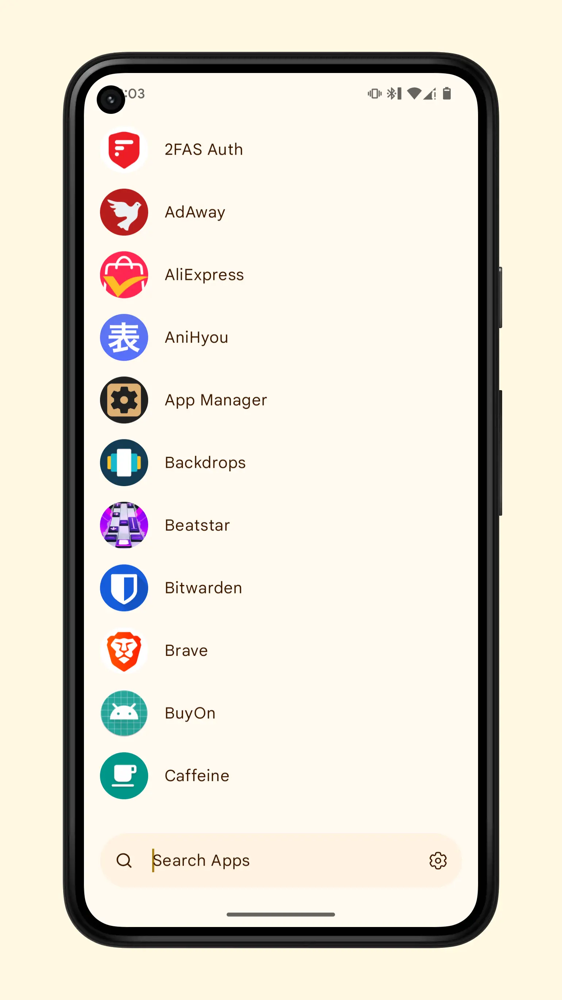

# About
Claw launcher is an easy to use launcher for android. It supports smartphones/tablets/foldables(beta).

It focus on being simple. There are no widgets or fancy things. Just a clock, a apps page and a search page. IN regards to theming it can either have material you theming or have whiskers color scheme themes. 

The app also support hiding apps and secure others with fingerprint. 

# Previews

# Install
To instal the app you can use one of the following methods.

  

> [!NOTE]
> App still not in play-store

  

> [!NOTE]
> App still not in f-droid

  

# Contributors
The people that are helping the project with minor or big changes.

